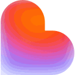

# ⚡ EyeTime OS — Personal Flow & Focus Operating System

<div align="center">



**Open-source personal productivity, attention guardian & flow state system.**  
*Combines a Chromium Extension (Fintrixity Neo-Dark) and a native Windows Sentinel daemon.*

[](https://opensource.org/licenses/MIT)
[]()
[]()

</div>

---

## ✨ Features at a Glance

### 1. 🛡️ Chrome Extension (Fintrixity Neo-Dark Theme)
- **Daily Focus Cockpit (New Tab)**:
  - Hero Focus Block with custom durations (25m / 50m / 90m).
  - Procedural Web Audio Tibetan Singing Bowl gong synthesis (~196 Hz) without external audio files.
  - Automatic launch of personalized soundscapes (e.g. Endel Focus player).
  - Customizable goals, scratchpad for quick thought capture, and bedtime countdown.
- **🩻 Anti-Doomscroll (Shorts / Reels / Clips Killer)**:
  - Detects YouTube Shorts, Instagram Reels, VK Clips, and TikTok.
  - After 60 seconds of doomscrolling, the screen automatically transitions to **100% Black & White (Grayscale)**, pauses video playback, and presents a friction intervention modal.
- **📊 Analytics & 7-Day Matrix**:
  - Full-page analytics with true 7-day Monday–Sunday calendar.
  - 24-hour activity curve.
  - Category donut chart (AI Tools, Development, Communication, Media, System).
- **🔒 Anti-Bypass Protection**:
  - Automatically intercepts extension disabling and incognito bypass attempts.

### 2. 💻 Windows Desktop Sentinel (Python 3 Win32)
- **Runs 24/7 in Windows System Tray**:
  - Lives silently down by the system clock without cluttering your taskbar.
  - Consumes only ~5 MB of RAM.
- **Dynamic System Tray Tooltip**:
  - Reflects the currently active application in real-time (`EyeTime OS · VS Code`, `EyeTime OS · AFK`).
- **Precision Window Resolution**:
  - Uses `QueryFullProcessImageNameW` (0x1000) for cross-integrity process tracking.
- **Distraction Killer during Focus**:
  - Minimizes gaming and entertainment windows during active focus sessions.
- **Unauthorized Browser Blocker**:
  - Closes non-monitored browsers (Edge, Firefox, Brave, Opera, Tor) to enforce accountability.

---

## 🚀 Quick Start & Installation

### Option A: Chrome Extension
1. Clone or download this repository:
   ```bash
   git clone https://github.com/maxbzd/eyetime.git
   ```
2. Open Google Chrome and navigate to `chrome://extensions/`.
3. Enable **Developer mode** (toggle in the top-right corner).
4. Click **Load unpacked** (Загрузить распакованное расширение) and select this folder.

### Option B: Windows Desktop Tracker
1. Ensure Python 3.9+ is installed on Windows.
2. Double-click **`EyeTime_Desktop_Setup.bat`** (or `desktop_tracker/install_autostart.bat`).
3. The app will install lightweight dependencies (`pystray`, `pillow`) and launch directly into your Windows notification tray.

---

## 🎨 Design Philosophy: Fintrixity Neo-Dark
- Deep Obsidian background (`#0B0C10`).
- Ambient Fire Orange glows and specular glass reflections (`rgba(255, 255, 255, 0.28)`).
- Bento grid modularity.
- Tabular figures and high-contrast typography.

---

## 🔒 100% Privacy & Local-First
EyeTime OS does **not** send your browsing history, window titles, or metrics to any cloud servers. Everything is stored locally on your own machine in browser storage and local JSON files.

---

## 📄 License
This project is open-source and licensed under the [MIT License](LICENSE).
